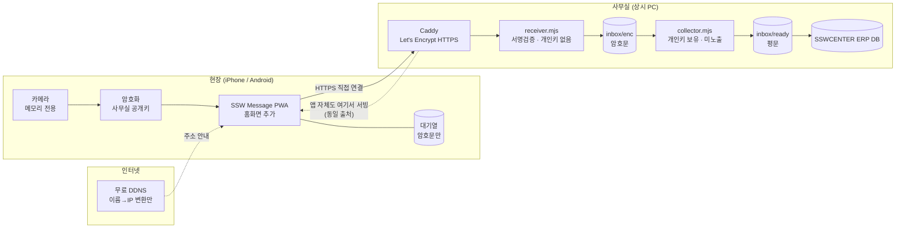

# SSW Message — 설계서 (v0.3)

> 현장/외근용 보조 앱. SSWCENTER ERP와 **직접 연결하지 않고**, 사무실의 정해진 공간에
> 정해진 양식으로 "떨궈두면" ERP가 알아서 수집해 가는 단방향 투입 도구.

| | |
|---|---|
| 작성 | 2026-08-17 |
| 개정 | v0.3 — 서류 촬영 확정, 문서 보정 도입, 전달 확인 2단계, 리눅스 미니PC |
| 전송 경로 | **확정: 사무실 직접 수신 + E2E 암호화** |
| 서버 | **확정: 리눅스 미니PC** (N100급 / RAM 8GB / SSD 256GB, LUKS 암호화) |
| 관련 문서 | [TRANSPORT.md](docs/TRANSPORT.md) · [CONTRACT.md](docs/CONTRACT.md) · [PIPELINE.md](docs/PIPELINE.md) · [SETUP.md](docs/SETUP.md) |
| 선행 프로젝트 | [WorkCadenceTransfer](https://github.com/tryo528-blip/WorkCadenceTransfer) — 정규화 정책·오류 코드를 흡수 |

> **코드와 규격의 현재 간극**: 서버 프로토타입은 CONTRACT **v2** 구현이고, 규격은 **v3** 입니다.
> v3 동기화(식별자 분리·오류 코드·상태 조회·바이너리 전송)는 다음 구현 과제입니다.

---

## 1. 요구사항

| # | 요구 | 성공 기준 |
|---|---|---|
| F1 | 할일 메모를 자유롭게 작성 → 정해진 양식으로 전송 | ERP 수집기가 파싱 실패 없이 100% 취득 |
| F2 | 사진 촬영 → 사무실로 전송 | 업로드 성공 후 원본이 기기에 남지 않음 |
| C1 | **사진이 휴대폰 갤러리에 저장되면 안 됨** | 카메라롤/사진앱/DCIM 어디에도 파일 없음 |
| **C2** | **개인정보가 제3자 서버에 남으면 안 됨** | 외부 사업자 디스크·메모리에 평문 미체류 |
| C3 | 사무실 전송 비용 0원 | 월 고정비 0, 스토어 등록비 0 |
| C4 | iPhone + Android 동시 지원 | 두 OS에서 동일 코드로 동작 |
| **F3** | **서류 사진을 스캐너로 뜬 것처럼 보정** | 원근 보정 + 판독성 향상. 실패 시 원본 유지 |
| **N0** | **다시 찍어올 수 없는 사진이 있다** | 도착 확인 전에는 폰에서 지우지 않음 |
| N1 | 현장 네트워크 불안정 | 실패분 자동 재전송, 재촬영 강요 없음 |
| N2 | 조작이 단순해야 함 | 홈 → 2탭 이내 전송 완료 |

C2가 v0.2에서 추가되면서 전송 경로가 전면 교체됐습니다. 경위는 TRANSPORT.md 참조.
F3·N0은 v0.3에서 추가됐습니다. 촬영 대상이 **주로 서류**임이 확인되면서
문서 보정이 들어왔고, "재촬영이 불가능한 건이 있다"는 사실이 삭제 정책을 바꿨습니다.

---

## 2. 핵심 설계 판단

### 판단 1. 네이티브 앱이 아니라 **PWA(웹앱)**

아이폰 네이티브 배포는 Apple Developer 연 $99가 고정 지출입니다. C3와 충돌합니다.
PWA는 홈화면 추가로 앱처럼 동작하고, 업데이트는 새로고침이면 끝이며,
iOS 14.3+ / Android Chrome 모두 standalone 상태에서 카메라가 동작합니다.

### 판단 2. 카메라는 `<input capture>` 금지, **`getUserMedia`만 사용**

C1을 구조적으로 보장하는 지점입니다.

```
[X] <input type="file" accept="image/*" capture="environment">
    → OS 기본 카메라 앱 호출 → OEM 카메라가 DCIM에 먼저 저장하고 앱에 넘김
    → 갤러리에 남음. C1 위반.

[O] navigator.mediaDevices.getUserMedia({ video: { facingMode: 'environment' } })
    → 브라우저 내부 프리뷰 → <canvas> 캡처 → Blob
    → 파일시스템 미경유. 메모리에만 존재.
```

부수 효과로 canvas 재인코딩 시 **EXIF(GPS·기기정보)가 전부 소멸**합니다.
[spike/camera](spike/camera/) 에서 실측 확인 완료 (canvas 산출 JPEG의 EXIF 마커 부재).

추가 방어: 미리보기를 `<canvas>`로 렌더(iOS 길게눌러 저장 차단),
`-webkit-touch-callout:none`, 전송 후 즉시 참조 해제.

**한계 — 스크린샷은 막을 수 없습니다.** 웹이든 네이티브든 iOS에서는 불가능합니다.
운영 규칙으로 관리해야 합니다.

### 판단 3. 제3자를 경유하지 않는다 — **사무실 직접 수신**

폰이 사무실 PC와 직접 TLS를 맺습니다. 중간에 아무도 없습니다.
관건이던 인증서 문제는 **무료 DDNS + Let's Encrypt** 로 해결합니다(비용 0).
제3자로 남는 건 DNS 사업자와 인증서 발급기관뿐이고, 둘 다 데이터를 볼 수 없습니다.

**PWA도 이 서버에서 서빙합니다.** 앱 코드와 수신 엔드포인트가 같은 출처가 되어
제3자 호스팅이 사라집니다. 웹 E2E 암호화의 고전적 약점(악성 코드 배달)이 함께 해소됩니다.

### 판단 4. 그 위에 **E2E 암호화**를 얹는다

경로가 안전해도, 사무실 디스크에 놓인 수집 전 파일은 평문입니다.
폰에서 사무실 공개키로 암호화하면 그 구간까지 보호됩니다.

```
ECDH(P-256) + HKDF-SHA256 + AES-256-GCM   ← 전부 브라우저 기본 API
```

실측(2026-08-17): **300KB 사진 암호화 1ms, 전송량 증가 93바이트, 외부 라이브러리 0개.**
전송마다 임시 키쌍을 새로 만들어 한 건이 뚫려도 다른 건은 안전합니다.

**대가:** 개인키를 잃으면 미수집 데이터는 영구 복구 불가입니다. 백업 규칙이 필수입니다.

### 판단 5. **수신과 복호화를 분리**한다

인터넷에 노출되는 프로세스가 개인키를 갖지 않게 합니다.

```
인터넷 ──▶ receiver  ──▶ 암호문 저장 ──▶ collector ──▶ 평문 ──▶ ERP
           개인키 없음                    개인키 보유 · 미노출
```

수신 서버가 통째로 털려도 지난 사진은 복호화되지 않습니다.
프로토타입에서 실증 완료 — 암호문 보관소를 평문 검색하면 0건.

### 판단 6. **검증과 보정을 분리**한다

현장 요구가 판단을 바꿨습니다 — **다시 찍어올 수 없는 사진이 있습니다.**
따라서 폰은 "잘 도착했다"가 확정되기 전에 지우면 안 됩니다.

그런데 문서 보정은 장당 수 초가 걸립니다. 폰이 그걸 기다리면 현장에서 서 있는 시간이 늡니다.
**폰이 확인해야 하는 건 "온전히 도착했는가"지 "보정이 끝났는가"가 아닙니다.**

| | 1단계 · 검증 | 2단계 · 보정 |
|---|---|---|
| 하는 일 | 복호화 → 해시 대조 → 정규화 저장 | 원근 보정 → 판독성 향상 |
| 소요 | 수백 ms | 장당 1~5초 |
| 폰 | **기다림** (완료 시 로컬 삭제) | 무관 |
| 실패 시 | 폰이 계속 보유 → 재전송 | 정규화본 유지 → **손실 없음** |

폰 체감 대기는 1~2초입니다. 상세는 [PIPELINE.md](docs/PIPELINE.md).

### 판단 7. 보정은 **실패를 전제로** 설계한다

문서 영역 자동 감지는 실패합니다. 배경이 어수선하거나 종이가 접혔거나 그림자가 지면
엉뚱하게 잘라냅니다. **잘못된 원근 변환은 보정하지 않는 것보다 나쁩니다.**

- 정규화본을 **항상** 보존하고, 보정본은 부가물로 둡니다
- 사각형 후보를 확신하지 못하면 **시도하지 않고 건너뜁니다**
- 보정 실패는 에러가 아닙니다. 데이터가 사라지지 않기 때문입니다
- ERP는 보정본이 있으면 쓰고, 없으면 정규화본을 씁니다

---

## 3. 전체 구조



제3자 서버에 데이터가 **저장되지도, 평문으로 경유하지도 않습니다.**

---

## 4. 화면 설계

```
┌─────────────────────┐   ┌─────────────────────┐   ┌─────────────────────┐
│  SSW Message    ⚙  │   │ ← 메모              │   │  [카메라 전체화면]  │
│                     │   │                     │   │                     │
│ ┌─────────────────┐ │   │ 분류                │   │   실시간 프리뷰     │
│ │       📝        │ │   │ [할일][AS][견적]    │   │   (getUserMedia)    │
│ │   메모 보내기   │ │   │ [구매][기타]        │   │                     │
│ └─────────────────┘ │   │                     │   │                     │
│ ┌─────────────────┐ │   │ ┌─────────────────┐ │   │  촬영됨 3장         │
│ │       📷        │ │   │ │ 자유 입력...    │ │   │                     │
│ │   사진 보내기   │ │   │ │                 │ │   │    ( ○ )  셔터      │
│ └─────────────────┘ │   │ └─────────────────┘ │   │  취소        전송 → │
│                     │   │                     │   │                     │
│ 최근 전송           │   │                     │   │ 🔒 암호화 전송 ·    │
│ ✓ 09:12 메모        │   │      [ 전 송 ]      │   │   기기에 저장 안 됨 │
│ ✓ 09:05 사진 2장    │   │                     │   │                     │
│ ⏳ 08:50 메모(대기) │   │                     │   │                     │
└─────────────────────┘   └─────────────────────┘   └─────────────────────┘
```

- **홈** — 버튼 2개 + 최근 전송 로그 20건(메타데이터만, 썸네일 저장 안 함)
- **메모** — 분류 칩 + 자유 텍스트. 전송 후 자동 홈 복귀
- **카메라** — 진입 즉시 후면 카메라. 연속 촬영 최대 5장(메모리 보호).
  썸네일은 canvas로만 표시, 개별 삭제 가능
- **설정** — 사용자명 / 기본 현장 / 화질 / **QR 스캔 등록**

**QR 프로비저닝** — 관리자가 `node keygen.mjs device 홍길동` 을 실행하면 나오는 JSON을
QR로 만들어 직원이 스캔합니다. 서버 주소·기기 비밀값·**사무실 공개키**가 한 번에 등록됩니다.
타이핑 0회. QR에 비밀값이 들어가므로 **QR 생성은 반드시 오프라인 도구로** 합니다.

---

## 5. 데이터 흐름 (사진 1장)

```
셔터 탭
 → canvas.drawImage(video)                    # 메모리
 → canvas.toBlob('image/jpeg', 0.8)           # 긴 변 1600px, EXIF 소멸
 → SHA-256 계산
 → 임시 키쌍 생성 → ECDH(사무실 공개키) → HKDF → AES-256-GCM 암호화   # ~1ms
 → HMAC 서명 (기기 비밀값)
 → POST /api/upload
 → 200 OK
 → 평문·암호문 전부 참조 해제, canvas 클리어
 → 로그에 "09:05 사진 1장 ✓" (메타만)
```

**전송 실패 시** — 실패분은 **이미 암호화된 상태로만** 대기열에 넣습니다.
폰에는 개인키가 없으므로 앱 자신도 열 수 없습니다. 최대 6시간 보관 후 자동 폐기,
홈 화면에 대기 건수를 상시 표시합니다.

> 평문 사진은 어떤 순간에도 기기 저장소에 존재하지 않습니다.
> 저장 가능한 형태가 되는 시점에는 이미 우리도 못 읽습니다.

---

## 6. 보안 / 개인정보

| 위협 | 대응 | 상태 |
|---|---|---|
| 제3자 서버에 개인정보 잔존 | 직접 수신 — 경유 사업자 없음 | 구조적 해결 |
| 수신 서버 침해 | 개인키 미보유. 암호문만 존재 | 프로토타입 실증 |
| 사무실 디스크 유출 | 수집 전까지 암호문 | 실증 |
| 전송 구간 도청 | 폰↔사무실 종단간 TLS | Caddy |
| 요청 캡처 후 재전송 | 5분 시각 윈도우 + id 멱등 | 검사 통과 |
| 요청 위조·변조 | 기기별 HMAC 서명, id를 AAD로 결속 | 검사 통과 |
| 미등록 기기 | 화이트리스트, 401 | 검사 통과 |
| 대량 투입 | 분당 30건 / 일 500건, 429 | 검사 통과 |
| 분실 단말 | `devices.json` 에서 폐기 → 즉시 차단 | 구현됨 |
| 사진 로컬 잔존 | 판단 2 (파일시스템 미경유) | **실기 검증 대기** |
| 앱 코드 변조 배달 | 자체 서빙(동일 출처) | 구조적 해결 |
| **개인키 분실** | USB 2벌 백업, 1벌은 사무실 외부 | **운영 규칙** |
| 스크린샷 | 기술적 차단 불가 | 교육 |

---

## 7. 기술 스택

**앱(PWA)** — Vite + React + TypeScript, `vite-plugin-pwa`, `idb-keyval`(대기열·설정),
카메라는 `getUserMedia` + `<canvas>`, 암호화는 Web Crypto, QR은 `BarcodeDetector` + `jsQR` 폴백.

**서버** — Node.js **외부 패키지 0개** (내장 모듈만). 앞단 Caddy가 HTTPS 담당.

**보정** — Python + OpenCV. 여기서 처음으로 외부 의존성이 생깁니다.
리눅스 미니PC이므로 `apt` 로 설치하면 끝이라 부담이 크지 않습니다.
1단계(검증)와 프로세스를 분리해, 보정 쪽이 죽어도 수신·검증은 계속 돕니다.

**미니PC** — Ubuntu Server. Receiver / Collector / Caddy 를 systemd로 등록.
**LUKS 전체 디스크 암호화 필수** — `ready/` 가 평문이므로 도난·반출 대비입니다.

**수집기** — 현재 `collector.mjs` 가 평문 파일까지 만듭니다.
ERP DB 투입부는 ERP 스택 확정 후 연결합니다.

---

## 8. 저장소 구조

```
ssw-message/
├─ DESIGN.md                  # 이 문서
├─ docs/
│  ├─ TRANSPORT.md            # 전송 경로 결정 근거
│  ├─ CONTRACT.md             # ERP 연동 규격 ★
│  └─ SETUP.md                # 사무실 설치 가이드
├─ spike/camera/              # 카메라·암호화 실기 검증 (빌드 없음)
├─ server/
│  ├─ keygen.mjs              # 키 생성 · 기기 등록 · QR 출력
│  ├─ receiver.mjs            # 수신 (개인키 없음, PWA 서빙 겸용)
│  ├─ collector.mjs           # 복호화 → ERP 투입용 평문
│  ├─ lib/envelope.mjs        # 암호화 규격 참조 구현
│  └─ test-client.mjs         # 폰 시뮬레이터 + 검사 9종
└─ app/                       # PWA (P1에서 생성)
```

`server/keys/` 와 `server/inbox/` 는 `.gitignore` 로 커밋이 차단돼 있습니다.

---

## 9. 진행 상황

| 단계 | 내용 | 상태 |
|---|---|---|
| P0-a | 설계·연동 규격 v3 | ✅ 완료 |
| P0-b | 수신 서버 + 복호화 + 검사 9종 (**v2 구현**) | ✅ 완료 (전부 통과) |
| **P0-c** | **카메라 갤러리 미저장 실기 검증** | 🔴 **대기 — 최대 리스크** |
| P1 | 미니PC 구매 + 설치 (Ubuntu·LUKS·DDNS·Caddy·systemd) | 대기 |
| P2 | **서버 v3 동기화** — 식별자 분리, 오류 코드, 상태 조회, 바이너리 전송 | 대기 |
| P3 | PWA 본체 (메모 → 카메라 → 암호화 → 전송 → 확인 → 삭제) | 대기 |
| P4 | 문서 보정 파이프라인 (Python + OpenCV) | 대기 |
| P5 | 대기함 UI, QR 등록, 설정 | 대기 |
| P6 | ERP 수집기 연결 + 운영 도구(로그·디스크·자동삭제) | 대기 |

**P0-c가 프로젝트 성패입니다.** 아이폰·갤럭시 실기에서 촬영 후 갤러리를 직접 확인해
"안 남는다"가 확인돼야 그 뒤로 갑니다. 여기서 실패하면 설계 전제가 깨집니다.

P1을 먼저 하면 P0-c를 별도 준비 없이 실환경에서 할 수 있습니다
(수신 서버가 카메라 검증 페이지를 함께 서빙).

---

## 10. 남은 확정 사항

1. 메모 분류 코드 — ERP 기존 코드와 맞춰야 함 (현재 TODO/AS/QUOTE/PURCHASE/ETC 가안)
2. ERP 수집기 연결 방식 — 폴더를 ERP가 직접 읽을지, 담당자가 볼지
3. 사진 보존기간 — 서류 중심이므로 법정 보존 요건 확인 필요
4. 사용 인원 수 / 하루 예상 건수 — 레이트리밋 상한 재조정
5. 개인키 백업 담당자와 보관 장소

### 의도적으로 뺀 것 (1차 범위 밖)

기능을 빼먹은 게 아니라, 첫 버전을 작고 검증 가능하게 만들기 위한 결정입니다.
실제 필요가 확인되면 별도로 승인해 넣습니다.

| 항목 | 이유 |
|---|---|
| 백그라운드 자동 전송 | 사용자가 화면을 보고 누를 때만 데이터가 움직인다는 원칙 |
| 카톡·문자 공유 수신 | **iOS PWA는 공유 대상 등록이 불가.** 네이티브가 필요해 연 $99 발생. 게다가 이미 폰에 있는 사진이라 목적이 다름 |
| TLS 지문 피닝 | 브라우저에서 인증서 접근 불가. 정식 인증서가 역할을 대신함 |
| OCR·자동 분류 | 촬영·전송 목적에 불필요. 공격면과 검수 범위만 커짐 |
| 푸시 알림, 다중 PC | 1차 범위 밖 |
